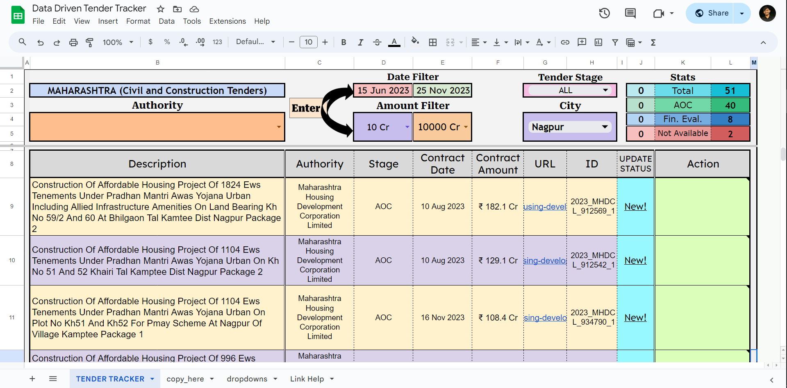

## Data-Driven Tender Tracker

This Python application is designed to streamline collecting and organizing Indian tender data. With Data-Driven Tender Tracker, you can provide a URL, and the application will scrape the relevant data and push it directly to a Google Sheet.

Key Features

- Efficient Data Collection: Effortlessly scrape tender data from Indian websites.
- Seamless Google Sheets Integration: Automatically populate your Google Sheets with the extracted data.
- User-Friendly Interface: Interact with the application through a simple and intuitive interface.
